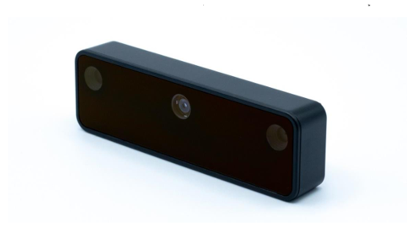

<h1 align="center">OAK-D Lite</h1>

  

  A OAK-D Lite é uma câmera inteligente que combina visão e processamento de IA embarcado
  com unidade de medição inercial (IMU), sendo desenvolvida para aplicações
  de visão computacional e robótica.

## Principais características

- Câmera RGB de até 13 MP;
- Duas câmeras monocromáticas para visão estéreo;
- Percepção de profundidade;
- Processamento de IA embarcado;
- Unidade de medição inercial (IMU);
- Interface USB-C;
- Detecção e rastreamento de objetos.

## <mark>Descrição</mark>

  <strong>Sistema de visão</strong>

A OAK-D Lite é um dispositivo desenvolvido pela Luxonis que reúne
diferentes recursos de percepção em uma única câmera. O sistema é
composto por uma câmera RGB e duas câmeras monocromáticas utilizadas
para obter informações de profundidade por meio de visão estéreo.

  <strong>Percepção de profundidade</strong>

A profundidade é obtida a partir da comparação das imagens capturadas
pelas duas câmeras monocromáticas. Como as câmeras estão posicionadas
em diferentes pontos, o sistema consegue determinar a distância dos
objetos presentes no ambiente por meio da disparidade entre as imagens.

Esse recurso permite que a OAK-D Lite obtenha informações
tridimensionais do ambiente.

> A percepção de profundidade é realizada utilizando o sistema de visão
> estéreo formado pelas duas câmeras monocromáticas.

  <strong>Câmeras estéreo</strong>

O sistema estéreo é composto por duas câmeras monocromáticas.
Essas câmeras são utilizadas principalmente para calcular a
profundidade do ambiente.

- Sensor: OV7251;
- Tipo: monocromático;
- Resolução: até 640 × 480;
- Global Shutter;
- Campo de visão horizontal: aproximadamente 73°;
- Baseline: 75 mm.

  <strong>Unidade de Medição Inercial (IMU)</strong>

A OAK-D Lite também possui uma unidade de medição inercial. A IMU fornece informações provenientes de acelerômetro
e giroscópio, permitindo obter informações relacionadas ao movimento
do dispositivo.

Esse recurso pode ser utilizado em conjunto com os dados das câmeras
em aplicações de navegação, localização e fusão de sensores.

  <strong>Conexão</strong>

A comunicação com o computador é realizada por meio de uma interface
USB-C. A conexão permite transmitir os dados capturados pelas câmeras
e também realizar a comunicação com aplicações desenvolvidas para
utilizar a plataforma DepthAI.

## <mark>Algumas aplicações</mark>

1. Robótica móvel;

2. Navegação autônoma;

3. Mapeamento tridimensional;
   
5. Detecção de obstáculos.

## <mark>Aplicação no projeto</mark>

  <strong>SLAM e navegação robótica</strong>

No contexto deste projeto, a OAK-D Lite pode ser utilizada como um dos
principais sensores de percepção do robô. As câmeras estéreo permitem
obter informações de profundidade, enquanto a câmera RGB fornece
informações visuais do ambiente.

A combinação desses dados pode auxiliar na identificação de obstáculos,
percepção do ambiente e navegação autônoma. A IMU também pode fornecer
informações complementares sobre o movimento do robô, possibilitando a
utilização de técnicas de fusão de sensores.

  <strong>Integração com ROS 2</strong>

A OAK-D Lite pode ser integrada a sistemas robóticos utilizando ROS 2,
permitindo que os dados de imagem, profundidade e IMU sejam utilizados
por diferentes nós e algoritmos de percepção e navegação.

Essa integração é particularmente relevante para estudos envolvendo
SLAM, uma vez que os dados de percepção fornecidos pela câmera podem
ser utilizados para auxiliar na construção do mapa e na localização
do robô.

## Documentação

  <a href="OAK-D-Lite_Datasheet.pdf">
     <strong>Visualizar Datasheet</strong>
  </a>

