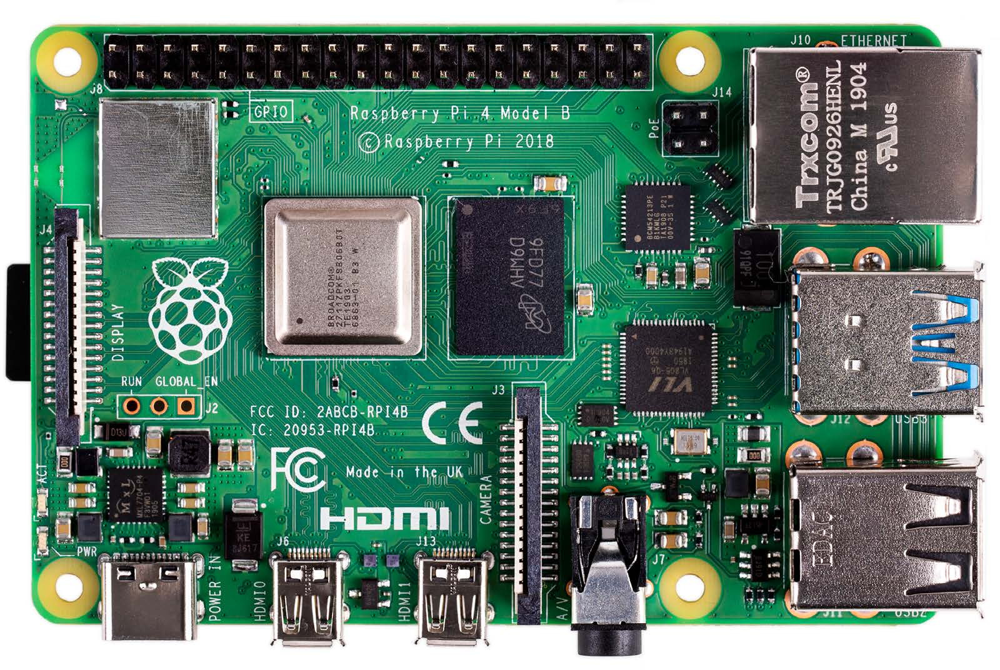

<h1 align="center">Raspberry Pi 4</h1>

  

  A Raspberry Pi 4 é um microcomputador compacto capaz de executar tarefas semelhantes às de um computador convencional, sendo ideal para aprendizado e projetos de robótica e automação.

## Principais características

- Conexão Wi-Fi e Bluetooth
- Portas USB 2.0 e USB 3.0
- Saída de vídeo dual micro-HDMI
- Interface Gigabit Ethernet
- Compatibilidade com Linux e Raspberry Pi OS
- Aplicações em robótica, automação e sistemas embarcados

## <mark>Descrição</mark>

  <strong>Memória</strong>

A Raspberry Pi 4 pode ser encontrada em diferentes versões de memória RAM, incluindo modelos com **1 GB, 2 GB, 4 GB e 8 GB**. A quantidade de memória disponível influencia diretamente a capacidade da placa de executar simultaneamente diferentes aplicações e processos.

No projeto, a memória pode ser utilizada para executar o sistema operacional, aplicações desenvolvidas em Python ou C/C++, além de ferramentas relacionadas ao ROS 2, processamento de sensores e algoritmos de navegação.

>A Raspberry Pi 4 possui diferentes interfaces de comunicação que permitem sua integração com sensores, atuadores e outros dispositivos.
>

  <strong>GPIO</strong>

A Raspberry Pi 4 possui um conector GPIO de **40 pinos**, permitindo a comunicação direta com componentes eletrônicos.

Por meio dos GPIOs, é possível realizar a leitura de sensores e o controle de dispositivos.

>Essa característica torna a Raspberry Pi adequada para projetos que necessitam de interação entre software e componentes eletrônicos.

  <strong>Sistema operacional</strong>

A Raspberry Pi 4 pode executar diferentes sistemas operacionais baseados em Linux. Entre eles, destaca-se o **Raspberry Pi OS**, desenvolvido especificamente para os computadores Raspberry Pi.

Também é possível utilizar distribuições compatíveis com diferentes aplicações, permitindo configurar o sistema de acordo com as necessidades do projeto.

  <strong>Aplicação no projeto</strong>

No projeto do robô, a Raspberry Pi 4 pode atuar como uma das principais unidades de processamento, sendo responsável pela execução do sistema operacional, comunicação com sensores e execução dos softwares utilizados para navegação e percepção do ambiente.

A placa também pode ser utilizada para executar ferramentas do **ROS 2**, programas desenvolvidos em **Python e C/C++**, além de realizar o processamento e gerenciamento dos dados provenientes de sensores como LiDAR e câmeras.

  <strong>Algumas aplicações:</strong>

1. Robótica móvel;

2. Sistemas autônomos;

3. Automação;

4. Processamento de sensores;

5. Visão computacional;

6. Projetos com ROS 2;

7. Internet das Coisas (IoT);

## Documentação

 <a href="Raspberry_Pi(datasheet).pdf">
  <strong>Visualizar Datasheet</strong>
 </a>

