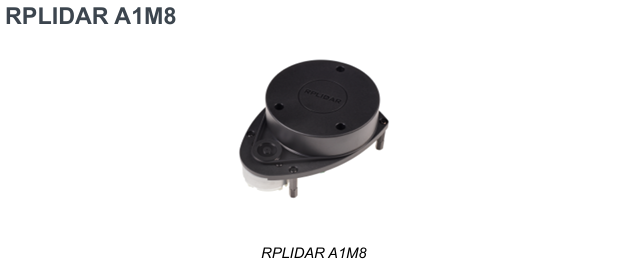

<h1 align="center">RPLIDAR_A1M8</h1>

  
 

 O RPLIDAR A1 é um sensor LiDAR utilizado em aplicações de SLAM.

## Principais características

- LiDAR 2D
- Varredura de 360°
- Interface USB/UART
- Aplicações de mapeamento e SLAM

 ## <mark>Descrição</mark>

 

  <strong>Conexão</strong>
 

 
Basicamente é um sistema de mensuração a base de triangulação a laser, funcionando bem em ambientes externos e internos (com perda de eficiência quando exposto a luz solar).
> "O sistema pode realizar uma varredura de 360 graus dentro de um alcance de 12 metros."
> 
Ele possui um sistema de detecção e adaptação de velocidade, cujo o mesmo é capaz de ajustar a frequência automaticamente de acordo com a velocidade do motor
> Acesse o datasheet para mais informações sobre sistema de conexão.
>

  <strong>Mecanismo</strong>
 

Em suma, o sistema emite um sinal de laser modulado 8000 vezes por segundo que reflete em superfícies e volta ao RPLiDAR. Esse sinal de retorno é exibido no sistema de visão no RPliDAR A1, o processador incorporado começa a processar os dados e, então, fornece o valor da distância e ângulo entre o objeto e o sistema, sendo exibido através da interface de comunnicação. 

> "The high-speed ranging scanner system is mounted on a spinning rotator with a 
build-in angular encoding system. During rotating, a 360 degree scan of the 
current environment will be performed."
>

  <strong>Algumas aplicações:</strong>
 

 
 1. Serviço doméstico (robôs de limpeza);
 
 2. Localização e navegação geral de robôs;
 
 3. Escaneamento do ambiente e remodelagem 3D;
 
 4. Localização e mapeamento simultâneo (SLAM)

  Segurança interna
 

O RPLiDAR A1 possui detecção de potência do laser e verificação da saúde do sensor. Para que seja garantido o funcionamento na faixa segura dele **<5mV**, ele irá desligar e parar de funcionar se algum dos seguintes erros forem detectados:

- A potência do laser encontra-se acima do valor limitado;
- O laser não liga normalmente;
- A velocidade de varredura do laser está instável;
- A velocidade de varredura está muito lenta;
- O funcionamento do laser possui alguma anormalidade

> O RPLiDAR pode ser reiniciado em sua interface a fim de tentar recuperar sua normalidade.
 
 
## Documentação

 <a href="[TurtleBot4Lite/datasheet/LD108_SLAMTEC_rplidar_datasheet_A1M8_v3.0_en.pdf](https://github.com/cassheelal/PIBITI_2026-2027/blob/main/TurtleBot4Lite/componentes/rplidar.md/LD108_SLAMTEC_rplidar_datasheet_A1M8_v3.0_en.pdf)">
  <strong>Visualizar Datasheet</strong>
 </a>

